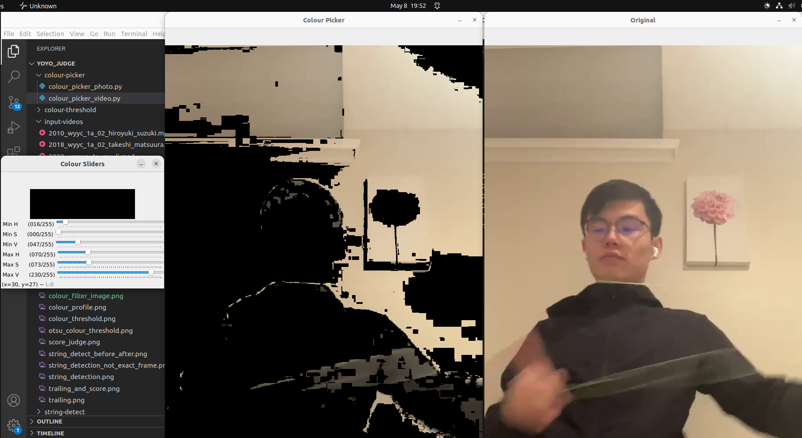
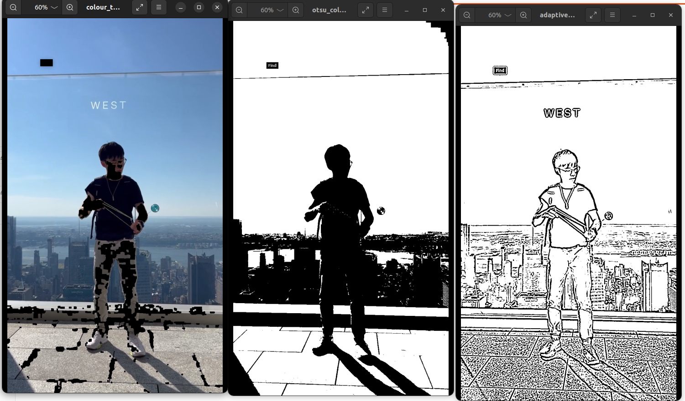

# YoYo_Computer_Vision_Collection

This is a collection of computer vision related projects and tests.

* YoYo Judge (Project)
* YoYo String Filter and Effects (Project)
* Colour Picker (Tool) 
* Colour Threshold (Experimental Scripts)

## Dependencies

The project uses `CV2` version `4.7.0`.


## YoYo Judge

Base yoyo tracker by [hanlinm2](https://github.com/hanlinm2/yoyo_tracking_vfx).

This is the initial version of an yoyo judge based on an existing yoyo tracking project. The yoyo judge operates under the assumption that a yoyo trick scores if it makes contact with the string. However, the initial version is unable to track the string yet. Thus we use the change of velocity as a simulated metric for contact with the string, since yoyo velocity changes dramatically when there is contact with the string. Depending on the player, you might need to modify the threshold for velocity change.

### Running the Project

To run the project, use the following command:

```python3 yoyo_tracker_judge.py```

### Trailing Animation from Reference Project and Judge V1


## YoYo String Filter and Effects
Although the script is under the name of "string detection", this is more of colour filtering. There are two parts of this project. First, use the colour picker tool to identify the max HSV values and min HSV values. 

### Colour Filter 

Colour filter for photos. Press `q` to quit.

```python3 colour_picker_photo.py```


Colour filter for videos. Press `n` to cause video. Press `q` to quit. Min and max HSV values will be outputed in the terminal.

```python3 colour_picker_video.py```




### String Colour Filtering and Effect

Modify the `detect_string_add_effect.py` file with your HSV min and max values. Modify the file to choose the colour of effect you want, input path and output path. 


## Colour Threshold (Experimental Scripts) 


